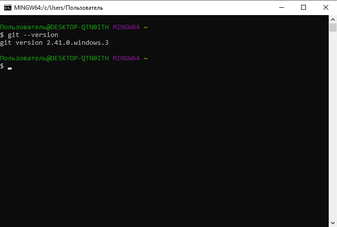
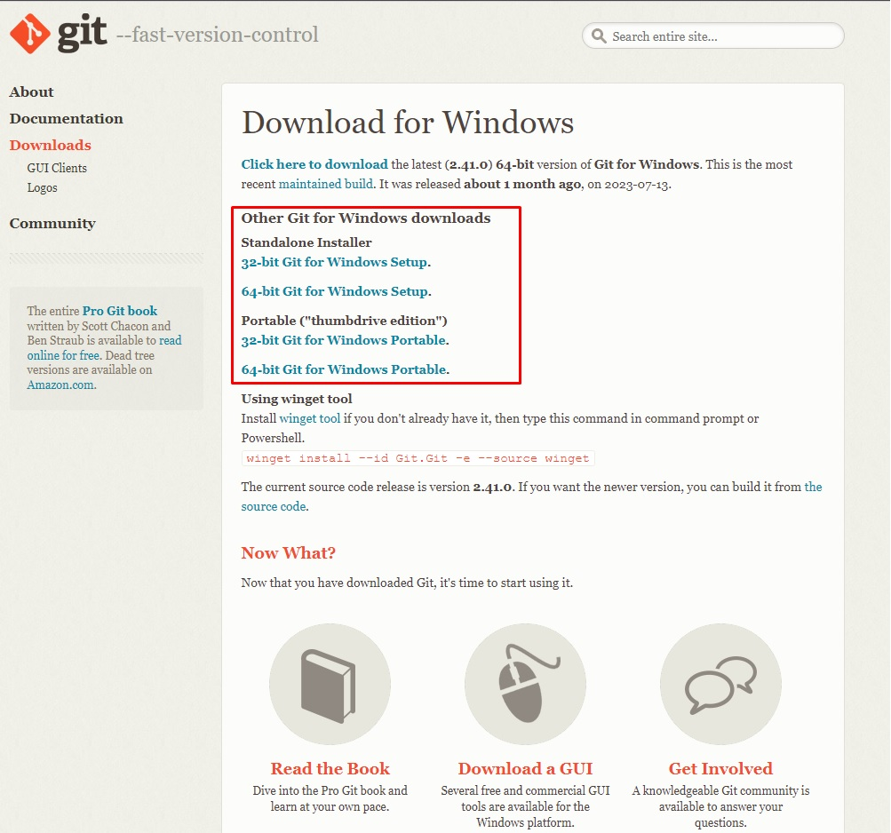
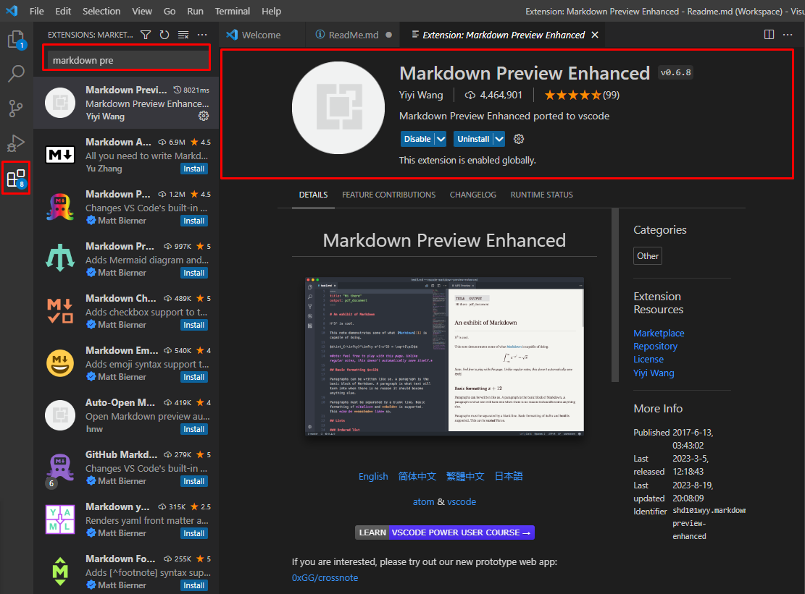
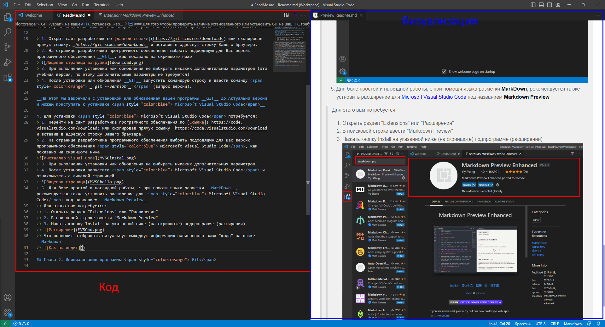
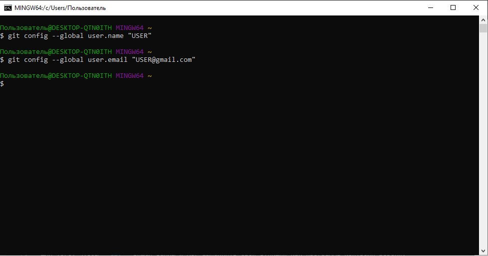

# Инструкция по работе с  Git, GitHub и  Microsoft Visual Studio Code.

## Глава 1. Проверка наличия установленного  GIT  на вашем ПК. Установка   GIT . Установка  Microsoft Visual Studio Code

### Для того чтобы проверить наличие установленного или установить GIT на Ваш ПК, требуется выполнить простые действия:

1. Открыть: ___Меню Пуск - Панель управления - Все программы___ и найти там Программу __GIT__

2. В случае наличия программы Git на вашем ПК:

> 1. Запустить программу __GIT__ 
> 2. Ввести команду  _'git --version'_  (запрос версии).
> 3. Получить ответ о текущей версии.
> 
> 4. Сравнить текущую версию с требуемой, или актуально на сайте разработчика

3. В случае получения ошибки при запросе версии или отсутствия программы __GIT__ на Вашем ПК:

> 1. Открыт сайт разработчик по [данной ссылке](https://git-scm.com/downloads) или скопировав прямую ссылку: _https://git-scm.com/downloads_ и вставив в адресную строку Вашего браузера.
> 2. На странице разработчика программного обеспечения выбрать подходящую для Вас версию программного обеспечения __GIT__, как показано на скриншоте ниже 
> 
> 3. При выполнении установки или обновления не выбирать никаких дополнительных параметров (это учебная версия, по этому дополнительные параметры не требуются)
> 4. После установки или обновления __GIT__ запустить командрую строку и ввести команду  _'git --version'_  (запрос версии).

__На этом мы закончили с установкой или обновлением вашей программы __GIT__ до Актуально версии и можем приступать к установке  Microsoft Visual Studio Code__

4. Для установки  Microsoft Visual Studio Code потребуется:
> 1. Перейти на сайт разработчика программного обеспечения по [Ссылке]( https://code.visualstudio.com/Download) или скопировав прямую ссылку  https://code.visualstudio.com/Download и вставив в адресную строку Вашего браузера.
> 2. На странице разработчика программного обеспечения выбрать подходящую для Вас версию программного обеспечения  Microsoft Visual Studio Code, как показано на скриншоте ниже
>
> 3. При выполнении установки или обновления не выбирать никаких дополнительных параметров.
> 4. После установки запустите  Microsoft Visual Studio Code и ознакомьтесь с лицевой страницей.
>  
> 5. Для боле простой и наглядной работы, с при помощи языка разметки __MarkDown__, рекомендуется также установить расширение для  Microsoft Visual Studio Code под названием __Markdown Preview__
>> Для этого вам потребуется:
>> 1. Открыть раздел "Extensions" или "Расширения"
>> 2. В поисковой строке ввести "Markdown Preview"
>> 3. Нажать кнопку Install на указанной ниже (на скриншоте) подпрограмме (расширении)
>> 
>> Что позволит отображать визуальную выходную информацию написанного вами "кода" на языке __Markdown__ 
>> 
>> Для вывода визуальной части потребуется сохранить ваш файл с расширением __.MD__, после чего  по нажатию ПКМ (правой кнопки мыши), вы увидите в контекстном меню __"Markdown Preview Enhanced: Open Preview to the side"__. Данная команда и активирует режим визуализации.

На этом подготовительные мероприятия для работы с __Markdown__ в  Microsoft Visual Studio Code и  Git - завершены. И мы можем перейти к работе с  Git.

## Глава 2. Инициализация программы  Git

Перед началом работы с  Git настоятельно рекомендуется ознакомится с полезными ресурсами:
1. [Git для Новичков. Часть 1](https://habr.com/ru/articles/541258/) и [Git для Новичков. Часть 2](https://habr.com/ru/articles/542616/).
2. [Пользовательский Мануал по Git от разработчиков](https://git-scm.com/docs/user-manual)

После ознакомления с данными ресурсами, мы можем перейти к настройке (инициализации) вашего __GIT__

### Шаг 1. Инициализация пользователя.
Для выполнения любых работ в __GIT__ потребуется проведение первичной авторизации клиента (администратора) ресурса. Для этого выполняются простые команды в терминале Вашего __GIT__
> 1. Установим Имя пользователя. Для этого используем команду:  git config   --global user.name   "__ваше_имя__"  - где вместо __ваше_имя__ прописывается имя пользователя, допустим __USER__.
>>Так, полученная команда для пользователя __USER__ будет выглядеть следующим образом: git config --global user.name "__USER__"
> 2. Установим Адрес электронной почты.Для этого используем команду:  git config   --global user.email   "__адрес_почты@email.com__"  - где вместо __адрес_почты@email.com__ прописывается адрес электронной почты пользователя, допустим __USER@gmail.com__.
>>Так, полученная команда для пользователя __USER__ будет выглядеть следующим образом: git config --global user.name "__USER@gmail.com__" 

__Внимание!__
1. Ввод "Логина" и электронной почты - являются обязательными для использования ПО __GIT__.
2. При вводе "Логина" и электронной почты, если данные команды выполнены верно, командная строка не вернёт никаких значений или сообщений. Итоговый результат должен выглядеть так:

3. Инициализацию пользователя можно также, сразу производить в  Microsoft Visual Studio Code через терминал.

### Шаг 2. Инициализация репозитория.

Для того, чтобы __GIT__ видел файлы и мог выполнять свои функции как программа контроля версий, требуется назначение места (репозитория) где будет находится проект или проекты. Для этого:
> 1. Пропишем команду  git init 
>> В ответ получим: __"Initialized empty Git repository in <Адрес репозитория>"__
>> Это означает в указанном месте, находится пустой репозиторий __GIT__.
> 2. Добавим файл, который будет отслеживаться программой __GIT__, для этого пропишем команду  git add  __<Имя файла>__
> 3. Добавим свой первый коммит, для этого пропишем команду  git commit -m  __"Комментарий"__

### Шаг 3. Запись изменений в репозитории. Отслеживание изменений. Просмотр коммитов. Перемещение между сохраненными файлами

Для выполнения записи и изменения файлов в репозитории, а также отслеживании этих изменений применяются следующие команды:
* git log  – вывод на экран истории всех коммитов с их хеш-кодами;
* git checkout  – переход от одного коммита к другому;
* git checkout master  – вернуться к актуальному состоянию и продолжить работу; 
* git diff  – увидеть разницу между текущим файлом и закоммиченным файлом;

__Как производится запись изменений в репозитории?__
> При инициализированом __GIT__ - запись производится автоматически, при ___каждом___ сохранении изменений в файлах.
Для проверки изменений можно использовать команды - __log, chekout__ и __diff__, они позволят отследить все имменения произведенные всеми пользователями с данным файлом, а также какие изменения произошли с файлом между его версиями.

В случае, если пользователь не забывает при изменении версий проставлять комментарии при помощи команды __commit__, также будет выведена информация комментария к версии.

>Пример:
$ git log --pretty=oneline 
 1b11970fd272176da7872f5b9f7a6c2b5c95b4be  ( HEAD  -> master ,  origin/master, origin/HEAD ) 220209 рег. громк. Si4735
 23cc805326427be3db40bcb5d2829311478d29b1  220201 косметические исправления в команде tp
f2459c4624ef818e06959ba5fe4c15c1e37d35d4  220127 Исправил влево-вправо для курсора
93daeff2400033f00e5adbf04fb68cab27e7f9ff  220123 Добавил кнопки TX и RX
509c2f29d919624d3b333fb819a08d94676652bd  220128 Исправил DEL, добавил индикатор РУС-ENG-dig
6c432e5613e0f099ec575833c5aabbc63e681df6  220115 Исправление режимов под клавиатуру TCA8418
65b292b712292b7ed6e88b7e5e2eadea480a52e9  220111 Исправил ошибку обработки ~INT для TCA8418
9048b714cbd83d3c3edffb5f8890ef9c935ef027  220110 Продолжение работы над TCA8418
 2fb1f10e57de7bc3887574212172bb772c0d8f9f  220109 Начало добавления новой клавиатуры на TCA8418
 1281f26518378f44ea669a3fd96317a391d7745c  211121 CMSIS в отдельной библиотеке
 1f920bb4327e43b58b6b3f735a63a21759dab351  211120 Драйверы HAL в отдельной библиотеке
 ab331d95634e248d9bbe4b291614e798c3ccc56d  220128 Исправил маяки и передачу.
 7ad03121d46f6ef7c7f992aaff6f033f1d6d3dc8  211119 Исправил перекос в меню настроек

Где оранжевым выделены номера версий коммитов (изменений файла), а черным комментарии разработчика. 
Далее мы выбираем определенную версию (к которой хотим перейти), допустим версия __"Добавления TX и RX"__, у которой номер коммета __"93daeff2400033f00e5adbf04fb68cab27e7f9ff"__. 
Для этого при помощи команды __chekout__ мы переходим к этой версии. При этом достаточно знать первые 6-8 HEX-символов (символов номера версии):

> $ git checkout 93daef
Note: switching to '93daef'.
>
> You are in 'detached HEAD' state. You can look around, make experimental changes and commit them, and you can discard any commits you make in this state without impacting any branches by switching back to a branch.
>
>If you want to create a new branch to retain commits you create, you may do so (now or later) by using -c with the switch command. Example:
> git switch -c < new-branch-name>
>
> Or undo this operation with:
> git switch -
>
>Turn off this advice by setting config variable advice.detachedHead to false HEAD is now at 93daeff 220123 Добавил кнопки TX и RX
>
> microsin@DESKTOP USER /d/asm/radiopager ((93daeff...))

### Перечень команд.

*  git status  - проверка сосотояния программы;
*  git config   --global user.name   "__ваше_имя__"  - инициализация пользователя;
*  git config   --global user.email   "__адрес_почты@email.com__"  - инициализация электронной почты пользователя;
*  git init  - инициализация репозитория;
*  git add  - добавление в репозиторий файла;
*  git commit -m  __"Комментарий"__ - запись комментария к выбранной версии файла;
* git log  – вывод на экран истории всех коммитов с их хеш-кодами;
* git checkout  – переход от одного коммита к другому;
* git checkout master  – вернуться к актуальному состоянию и продолжить работу; Полное описание можно найти по [Ссылке на справку разработчиков](https://git-scm.com/docs/git-checkout)
* git diff  – увидеть разницу между текущим файлом и закоммиченным файлом; Полное описание можно найти по [Ссылке на справку разработчиков](https://git-scm.com/docs/git-diff)
* git clear  - очищает командную строку;
* git help  - справка по всем командам;
* git branch  - команда управления ветками проектов; Полное описание можно найти по [Ссылке на справку разработчиков](https://git-scm.com/docs/git-branch)
* git-merge  - обьединие нескольких пользовательских историй файла в одну; Полное описание можно найти по [Ссылке на справку разработчиков] (https://git-scm.com/docs/git-merge)
* git remote  - удалённое управление некоторыми репозиториями; Полное описание можно найти по [Ссылке на справку разработчиков](https://git-scm.com/docs/git-remote)
* git fetch  - загрузка обьектов и ссылок из другого репозитория; Полное описание можно найти по [Ссылке на справку разработчиков](https://git-scm.com/docs/git-fetch)
* git push  - обновление удаленных ссылок вместе со связанными объектами. Полное описание можно найти по [Ссылке на справку разработчиков](https://git-scm.com/docs/git-push)

